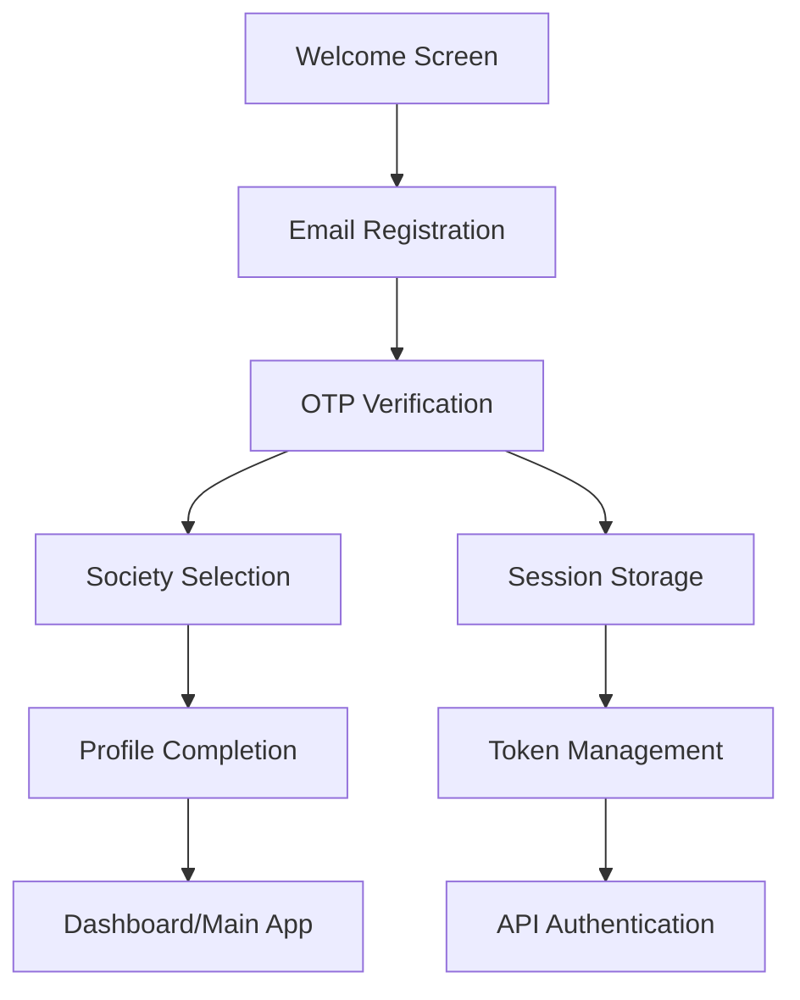
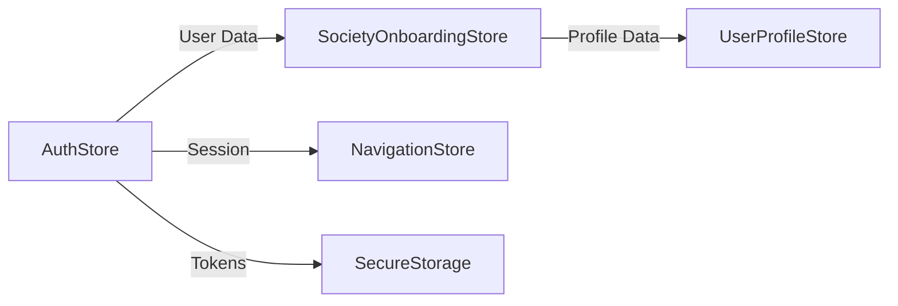
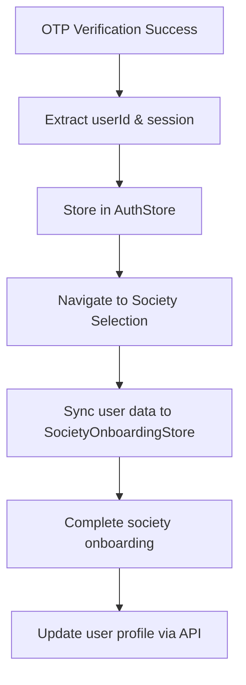

# Authentication and Session Management Analysis

## Table of Contents
1. [Executive Summary](#executive-summary)
2. [Authentication Flow Architecture](#authentication-flow-architecture)
3. [Session Management System](#session-management-system)
4. [Store Architecture & Data Flow](#store-architecture--data-flow)
5. [API Integration & Token Management](#api-integration--token-management)
6. [Security Implementation](#security-implementation)
7. [User Onboarding Integration](#user-onboarding-integration)
8. [File Structure Overview](#file-structure-overview)
9. [Critical Integration Points](#critical-integration-points)
10. [Data Persistence Strategy](#data-persistence-strategy)
11. [Error Handling & Recovery](#error-handling--recovery)
12. [Security Assessment](#security-assessment)
13. [Performance Considerations](#performance-considerations)
14. [Future Enhancements](#future-enhancements)
15. [Code Examples](#code-examples)
16. [Troubleshooting Guide](#troubleshooting-guide)

---

## 1. Executive Summary

### Current State Analysis

The Aptly React Native application implements a **modern authentication system** with email-based registration, OTP verification, and session-based token management. The system successfully integrates with the V4 backend API and provides secure user authentication with bearer token management.

### Key Components Identified

| Component | Purpose | Status |
|-----------|---------|--------|
| **AuthStore (Zustand)** | Authentication state management | ✅ Implemented |
| **SecureTokenStorage** | Token persistence & security | ✅ Implemented |
| **API Client** | HTTP client with token injection | ✅ Implemented |
| **OTP Verification** | Session creation & token extraction | ✅ Implemented |
| **Society Onboarding** | Post-auth user profile setup | ✅ Implemented |
| **Role-based Navigation** | Route protection & user routing | ✅ Implemented |

### Authentication Flow Status

```
Welcome → Email Registration → OTP Verification → Society Selection → Profile Complete → Dashboard
    ✅           ✅                    ✅                 ✅               ✅              🚧
```

---

## 2. Authentication Flow Architecture

### Complete User Journey



### API Endpoints Mapping

**From `/config/api.config.ts`:**
```typescript
AUTH: {
  EMAIL_REGISTER: '/api/v4/auth/register/email',
  VERIFY_EMAIL_OTP: '/api/v4/auth/verify-email-otp',
  REFRESH_TOKEN: '/api/v4/auth/refresh',
  LOGOUT: '/api/v4/auth/logout',
  ME: '/api/v4/user/profile',
  CREATE_PROFILE: '/api/v4/user/profile'
}
```

### Email Registration Flow

**File:** `/app/auth/email-registration.tsx`
- **Purpose:** Collects user email and initiates registration
- **API Call:** `POST /api/v4/auth/register/email`
- **Response:** Contains `sessionId` for OTP verification
- **State Management:** Form validation with `useFormValidation`

**Key Implementation:**
```typescript
const handleEmailSubmit = async (formData: EmailRegistrationForm) => {
  const result = await AuthService.registerWithEmail({
    email: formData.email,
    // Additional registration data
  });
  
  if (result.success) {
    // Navigate to OTP verification with sessionId
    router.push({
      pathname: '/auth/otp-verification',
      params: { sessionId: result.data.sessionId }
    });
  }
};
```

### OTP Verification & Session Creation

**File:** `/app/auth/otp-verification.tsx`
- **Purpose:** Verifies OTP and creates user session
- **API Call:** `POST /api/v4/auth/verify-email-otp`
- **Critical Function:** Extracts `userId` and session data
- **Token Storage:** Saves bearer token for subsequent API calls

**Session Extraction Logic:**
```typescript
const handleOTPVerification = async (otpCode: string) => {
  const result = await AuthService.verifyEmailOTP({
    sessionId,
    otpCode,
    email
  });
  
  if (result.success && result.data) {
    // Extract critical user data
    const { userId, token, user } = result.data;
    
    // Store authentication session
    await AuthStore.setSession({
      userId,
      token,
      user,
      isAuthenticated: true
    });
    
    // Navigate to society onboarding
    router.replace('/auth/society-selection');
  }
};
```

---

## 3. Session Management System

### Store Architecture Overview

**Primary Authentication Store:**
```typescript
// /stores/slices/authStore.ts
interface AuthStoreState {
  isAuthenticated: boolean;
  user: UserProfile | null;
  session: UserSession | null;
  token: string | null;
  refreshToken: string | null;
  loading: boolean;
  error: string | null;
}
```

### Token Storage Implementation

**Secure Storage Strategy:**
```typescript
// /utils/storage.secure.ts
class SecureTokenStorage {
  private static readonly TOKEN_KEY = 'auth_token';
  private static readonly REFRESH_TOKEN_KEY = 'refresh_token';
  private static readonly USER_SESSION_KEY = 'user_session';
  
  static async saveToken(token: string): Promise<void> {
    await AsyncStorage.setItem(this.TOKEN_KEY, token);
  }
  
  static async getToken(): Promise<string | null> {
    return await AsyncStorage.getItem(this.TOKEN_KEY);
  }
  
  static async saveSession(session: UserSession): Promise<void> {
    await AsyncStorage.setItem(this.USER_SESSION_KEY, JSON.stringify(session));
  }
}
```

### Bearer Token Injection

**API Client Configuration:**
```typescript
// /services/api.client.ts
class APIClient {
  private async attachAuthToken(config: any) {
    const token = await SecureTokenStorage.getToken();
    if (token) {
      config.headers.Authorization = `Bearer ${token}`;
    }
    return config;
  }
  
  setupInterceptors() {
    this.client.interceptors.request.use(this.attachAuthToken);
    this.client.interceptors.response.use(
      (response) => response,
      (error) => this.handleAuthError(error)
    );
  }
}
```

---

## 4. Store Architecture & Data Flow

### Zustand Store Relationships



### AuthStore Implementation

**Location:** `/stores/slices/authStore.ts`
```typescript
export const useAuthStore = create<AuthStore>()(
  devtools(
    persist(
      immer((set, get) => ({
        // State
        isAuthenticated: false,
        user: null,
        session: null,
        token: null,
        
        // Actions
        setSession: (sessionData) =>
          set((state) => {
            state.isAuthenticated = true;
            state.user = sessionData.user;
            state.session = sessionData.session;
            state.token = sessionData.token;
          }),
          
        logout: async () => {
          await SecureTokenStorage.clearAll();
          set((state) => {
            state.isAuthenticated = false;
            state.user = null;
            state.session = null;
            state.token = null;
          });
        }
      })),
      {
        name: 'auth-storage',
        storage: createSecureStorage('AuthStore')
      }
    )
  )
);
```

### Society Onboarding Store Integration

**Location:** `/stores/slices/societyOnboardingStore.ts`
```typescript
// User profile with session integration
userProfile: {
  fullName: string;
  phone: string;
  email: string;
  dateOfBirth: string;
  photo: string;
  sessionId?: string; // Links to auth session
}
```

**Data Propagation:**
```typescript
// Sync user data from auth to onboarding
const syncAuthData = () => {
  const authUser = useAuthStore.getState().user;
  if (authUser) {
    updateUserProfile({
      phone: authUser.phone,
      email: authUser.email,
      sessionId: authUser.sessionId
    });
  }
};
```

---

## 5. API Integration & Token Management

### HTTP Client Architecture

**File:** `/services/api.client.ts`
```typescript
class APIClient {
  private client: AxiosInstance;
  
  constructor() {
    this.client = axios.create({
      baseURL: API_CONFIG.BASE_URL,
      timeout: API_CONFIG.TIMEOUT,
      headers: API_CONFIG.DEFAULT_HEADERS
    });
    
    this.setupInterceptors();
  }
  
  private setupInterceptors() {
    // Request interceptor - Add auth token
    this.client.interceptors.request.use(
      async (config) => {
        const token = await SecureTokenStorage.getToken();
        if (token) {
          config.headers.Authorization = `Bearer ${token}`;
        }
        return config;
      }
    );
    
    // Response interceptor - Handle auth errors
    this.client.interceptors.response.use(
      (response) => response,
      async (error) => {
        if (error.response?.status === 401) {
          await this.handleTokenRefresh();
        }
        return Promise.reject(error);
      }
    );
  }
}
```

### Token Refresh Mechanism

**Proactive Token Refresh:**
```typescript
// /services/auth.service.rest.ts
class AuthService {
  static async refreshTokenIfNeeded() {
    const token = await SecureTokenStorage.getToken();
    const expiryTime = await SecureTokenStorage.getTokenExpiry();
    
    // Refresh 5 minutes before expiry
    const refreshThreshold = API_CONFIG.TOKEN_REFRESH_THRESHOLD;
    
    if (Date.now() + refreshThreshold > expiryTime) {
      await this.refreshToken();
    }
  }
  
  static async refreshToken() {
    const refreshToken = await SecureTokenStorage.getRefreshToken();
    
    const response = await APIClient.post(API_ENDPOINTS.AUTH.REFRESH_TOKEN, {
      refreshToken
    });
    
    if (response.data.success) {
      await SecureTokenStorage.saveToken(response.data.token);
      await SecureTokenStorage.saveRefreshToken(response.data.refreshToken);
    }
  }
}
```

---

## 6. Security Implementation

### Multi-layered Security Approach

**Layer 1: Transport Security**
- HTTPS/TLS encryption for all API communications
- Certificate pinning (recommended for production)

**Layer 2: Token Security**
- JWT bearer tokens with expiration
- Secure refresh token rotation
- Automatic token cleanup on logout

**Layer 3: Storage Security**
```typescript
// Enhanced secure storage with encryption
class SecureTokenStorage {
  private static encryptData(data: string): string {
    // Implement encryption logic
    return CryptoJS.AES.encrypt(data, deviceKey).toString();
  }
  
  private static decryptData(encryptedData: string): string {
    // Implement decryption logic
    return CryptoJS.AES.decrypt(encryptedData, deviceKey).toString(CryptoJS.enc.Utf8);
  }
}
```

**Layer 4: Session Validation**
```typescript
// Session integrity checks
const validateSession = async (): Promise<boolean> => {
  const session = await SecureTokenStorage.getSession();
  const currentTime = Date.now();
  
  // Check session expiry
  if (session.expiresAt < currentTime) {
    await AuthStore.logout();
    return false;
  }
  
  // Validate token format
  if (!isValidJWT(session.token)) {
    await AuthStore.logout();
    return false;
  }
  
  return true;
};
```

---

## 7. User Onboarding Integration

### Auth → Onboarding Data Flow



### Data Synchronization Points

**Point 1: Post-Authentication**
```typescript
// /app/auth/otp-verification.tsx
const handleSuccessfulAuth = async (authData) => {
  // Store auth data
  await AuthStore.setSession(authData);
  
  // Sync to onboarding store
  const societyStore = useSocietyOnboardingStore.getState();
  societyStore.updateUserProfile({
    phone: authData.user.phone,
    email: authData.user.email,
    sessionId: authData.sessionId
  });
  
  // Navigate to onboarding
  router.replace('/auth/society-selection');
};
```

**Point 2: Society Onboarding**
```typescript
// /stores/slices/societyOnboardingStore.ts
const submitJoinRequest = async () => {
  const authUser = useAuthStore.getState().user;
  const onboardingData = get().getOnboardingData();
  
  const joinRequest = {
    ...onboardingData,
    userProfile: {
      ...onboardingData.userProfile,
      // Ensure auth data is included
      userId: authUser.id,
      sessionId: authUser.sessionId
    }
  };
  
  await SocietyService.submitSocietyJoinRequest(joinRequest);
};
```

**Point 3: Profile Completion**
```typescript
// Final profile update with all collected data
const completeProfileSetup = async () => {
  const authData = useAuthStore.getState();
  const societyData = useSocietyOnboardingStore.getState();
  
  const completeProfile = {
    userId: authData.user.id,
    ...societyData.userProfile,
    ...societyData.residenceDetails,
    emergencyContacts: societyData.emergencyContacts,
    // Additional onboarding data
  };
  
  await UserService.updateProfile(completeProfile);
};
```

---

## 8. File Structure Overview

### Authentication Related Files

```
/stores/
├── slices/
│   ├── authStore.ts              # Main authentication state
│   ├── societyOnboardingStore.ts # Post-auth onboarding
│   └── userProfileStore.ts       # User profile management

/services/
├── auth.service.rest.ts          # Authentication API service
├── api.client.ts                 # HTTP client with token management
├── society.service.rest.ts       # Society onboarding API
└── user.service.rest.ts          # User profile API

/utils/
├── storage.secure.ts             # Secure storage utilities
├── auth.helpers.ts               # Authentication helper functions
└── token.validation.ts           # Token validation utilities

/app/auth/
├── email-registration.tsx        # Email registration screen
├── otp-verification.tsx          # OTP verification & session creation
├── society-selection.tsx         # Society selection (post-auth)
└── society-profile-complete.tsx  # Profile completion

/config/
├── api.config.ts                 # API configuration
└── auth.config.ts                # Authentication configuration

/types/
├── auth.types.ts                 # Authentication type definitions
├── user.types.ts                 # User profile types
└── society.types.ts              # Society onboarding types

/hooks/
├── useAuth.ts                    # Authentication hook
├── useSession.ts                 # Session management hook
└── useSecureStorage.ts           # Secure storage hook

/navigation/
├── AppNavigator.tsx              # Main navigation with auth routing
├── AuthNavigator.tsx             # Authentication flow navigation
└── MainNavigator.tsx             # Post-auth main app navigation
```

### Key Implementation Files

**Critical Authentication Files:**
1. `/stores/slices/authStore.ts` - Central authentication state management
2. `/services/auth.service.rest.ts` - Authentication API service layer
3. `/services/api.client.ts` - HTTP client with automatic token injection
4. `/app/auth/otp-verification.tsx` - Session creation and token extraction
5. `/utils/storage.secure.ts` - Secure token and session storage

---

## 9. Critical Integration Points

### Point 1: Token Extraction (OTP Verification)

**Location:** `/app/auth/otp-verification.tsx`
**Purpose:** Extract userId and session from API response
**Critical Code:**
```typescript
const verifyOTP = async (otpCode: string) => {
  const result = await AuthService.verifyEmailOTP({
    sessionId: route.params.sessionId,
    otpCode,
    email: route.params.email
  });
  
  if (result.success) {
    // CRITICAL: Extract userId and session
    const { userId, token, user, session } = result.data;
    
    // Store for future use
    await AuthStore.setSession({
      userId,
      token,
      user,
      session,
      isAuthenticated: true
    });
    
    // Navigate to next step
    router.replace('/auth/society-selection');
  }
};
```

### Point 2: Bearer Token Injection

**Location:** `/services/api.client.ts`
**Purpose:** Automatically add authorization header to all requests
**Implementation:**
```typescript
// Request interceptor
this.client.interceptors.request.use(async (config) => {
  const token = await SecureTokenStorage.getToken();
  
  if (token) {
    config.headers.Authorization = `Bearer ${token}`;
    console.log('🔐 Token attached to request:', config.url);
  }
  
  return config;
});
```

### Point 3: User Data Propagation

**From AuthStore to SocietyOnboardingStore:**
```typescript
// /stores/slices/societyOnboardingStore.ts
const syncUserDataFromAuth = () => {
  const authState = useAuthStore.getState();
  
  if (authState.isAuthenticated && authState.user) {
    set((state) => {
      state.userProfile.phone = authState.user.phone;
      state.userProfile.email = authState.user.email;
      state.userProfile.sessionId = authState.session?.id;
    });
  }
};
```

### Point 4: Session Persistence

**Store Configuration with Secure Persistence:**
```typescript
// /stores/slices/authStore.ts
export const useAuthStore = create<AuthStore>()(
  devtools(
    persist(
      immer((set, get) => ({
        // Store implementation
      })),
      {
        name: 'auth-storage',
        storage: {
          getItem: async (key) => {
            const value = await SecureTokenStorage.getItem(key);
            return value ? JSON.parse(value) : null;
          },
          setItem: async (key, value) => {
            await SecureTokenStorage.setItem(key, JSON.stringify(value));
          },
          removeItem: async (key) => {
            await SecureTokenStorage.removeItem(key);
          }
        }
      }
    )
  )
);
```

---

## 10. Data Persistence Strategy

### Storage Layers

**Layer 1: Temporary Session Storage**
- In-memory store states (Zustand)
- Cleared on app restart
- Used for UI state management

**Layer 2: Secure Persistent Storage**
- AsyncStorage with encryption
- Persists across app restarts
- Used for tokens and session data

**Layer 3: API Synchronization**
- Server-side session validation
- User profile synchronization
- Cross-device session management

### Storage Implementation

```typescript
// /utils/storage.secure.ts
class SecureTokenStorage {
  // Token storage with encryption
  static async saveToken(token: string): Promise<void> {
    const encrypted = await this.encrypt(token);
    await AsyncStorage.setItem('auth_token', encrypted);
  }
  
  // Session storage with role-based keys
  static async saveSession(session: UserSession): Promise<void> {
    const key = `user_session_${session.userId}`;
    const encrypted = await this.encrypt(JSON.stringify(session));
    await AsyncStorage.setItem(key, encrypted);
  }
  
  // Automatic cleanup on logout
  static async clearUserData(): Promise<void> {
    const keys = ['auth_token', 'refresh_token', 'user_session'];
    await AsyncStorage.multiRemove(keys);
  }
}
```

### Hydration Strategy

**Store Hydration on App Start:**
```typescript
// /stores/hydration.ts
export const hydrateAuthState = async () => {
  try {
    // Check for existing session
    const token = await SecureTokenStorage.getToken();
    const session = await SecureTokenStorage.getSession();
    
    if (token && session) {
      // Validate token is still valid
      const isValid = await AuthService.validateToken(token);
      
      if (isValid) {
        // Restore auth state
        useAuthStore.getState().setSession({
          token,
          session,
          isAuthenticated: true
        });
        
        return true; // User is authenticated
      } else {
        // Clear invalid session
        await SecureTokenStorage.clearUserData();
      }
    }
    
    return false; // User needs to authenticate
  } catch (error) {
    console.error('Hydration error:', error);
    return false;
  }
};
```

---

## 11. Error Handling & Recovery

### Authentication Error Types

```typescript
enum AuthErrorType {
  INVALID_CREDENTIALS = 'INVALID_CREDENTIALS',
  TOKEN_EXPIRED = 'TOKEN_EXPIRED',
  NETWORK_ERROR = 'NETWORK_ERROR',
  SESSION_INVALID = 'SESSION_INVALID',
  OTP_EXPIRED = 'OTP_EXPIRED',
  OTP_INVALID = 'OTP_INVALID'
}
```

### Error Recovery Mechanisms

**Token Refresh on 401 Errors:**
```typescript
// /services/api.client.ts
const handleAuthError = async (error: any) => {
  if (error.response?.status === 401) {
    console.log('🔄 Token expired, attempting refresh...');
    
    try {
      await AuthService.refreshToken();
      // Retry original request
      return this.client.request(error.config);
    } catch (refreshError) {
      console.log('❌ Token refresh failed, logging out user');
      await AuthStore.logout();
      NavigationService.reset('Auth');
    }
  }
  
  throw error;
};
```

**Session Recovery:**
```typescript
// /hooks/useAuth.ts
const useAuth = () => {
  const recoverSession = async () => {
    try {
      const session = await SecureTokenStorage.getSession();
      
      if (session) {
        // Validate with server
        const isValid = await AuthService.validateSession(session.id);
        
        if (isValid) {
          // Restore auth state
          AuthStore.setSession(session);
          return true;
        }
      }
      
      // Invalid or no session
      await AuthStore.logout();
      return false;
    } catch (error) {
      console.error('Session recovery failed:', error);
      await AuthStore.logout();
      return false;
    }
  };
  
  return { recoverSession };
};
```

**OTP Verification Error Handling:**
```typescript
// /app/auth/otp-verification.tsx
const handleOTPError = (error: AuthError) => {
  switch (error.type) {
    case AuthErrorType.OTP_EXPIRED:
      showAlert('OTP Expired', 'Please request a new OTP code');
      break;
      
    case AuthErrorType.OTP_INVALID:
      showAlert('Invalid OTP', 'Please check your code and try again');
      break;
      
    case AuthErrorType.NETWORK_ERROR:
      showAlert('Network Error', 'Please check your connection and try again');
      break;
      
    default:
      showAlert('Verification Failed', 'Please try again later');
  }
};
```

---

## 12. Security Assessment

### Current Security Strengths ✅

1. **Token Management**
   - Bearer token authentication
   - Automatic token refresh
   - Secure token storage with encryption
   - Token cleanup on logout

2. **Session Security**
   - Session validation on app start
   - Server-side session verification
   - Automatic session cleanup

3. **Storage Security**
   - AsyncStorage with encryption
   - Role-based storage keys
   - Secure data cleanup

4. **API Security**
   - HTTPS enforcement
   - Request/response interceptors
   - Automatic error handling

### Security Recommendations ⚠️

1. **Enhanced Token Security**
   ```typescript
   // Add JWT token validation
   const validateJWTStructure = (token: string): boolean => {
     const parts = token.split('.');
     return parts.length === 3 && parts.every(part => part.length > 0);
   };
   
   // Add token payload validation
   const validateTokenPayload = (token: string): boolean => {
     const payload = JWT.decode(token);
     return payload.exp > Date.now() / 1000;
   };
   ```

2. **Biometric Authentication**
   ```typescript
   // Add biometric authentication layer
   import * as LocalAuthentication from 'expo-local-authentication';
   
   const enableBiometricAuth = async () => {
     const hasHardware = await LocalAuthentication.hasHardwareAsync();
     const isEnrolled = await LocalAuthentication.isEnrolledAsync();
     
     if (hasHardware && isEnrolled) {
       return await LocalAuthentication.authenticateAsync({
         promptMessage: 'Authenticate to access your account'
       });
     }
     
     return { success: false };
   };
   ```

3. **Device Fingerprinting**
   ```typescript
   // Add device-specific security
   import { getUniqueId } from 'react-native-device-info';
   
   const createDeviceFingerprint = async () => {
     const deviceId = await getUniqueId();
     const timestamp = Date.now();
     
     return {
       deviceId,
       timestamp,
       hash: CryptoJS.SHA256(`${deviceId}_${timestamp}`).toString()
     };
   };
   ```

4. **Session Anomaly Detection**
   ```typescript
   // Monitor for unusual session activity
   const detectSessionAnomalies = (session: UserSession) => {
     const currentLocation = getCurrentLocation();
     const lastKnownLocation = session.lastLocation;
     
     // Check for impossible travel
     if (calculateDistance(currentLocation, lastKnownLocation) > THRESHOLD) {
       triggerSecurityAlert('Unusual location detected');
     }
   };
   ```

---

## 13. Performance Considerations

### Optimization Strategies

**1. Token Caching**
```typescript
// Cache tokens in memory for faster access
class TokenCache {
  private static cache = new Map<string, any>();
  
  static async getToken(key: string): Promise<string | null> {
    // Check memory cache first
    if (this.cache.has(key)) {
      return this.cache.get(key);
    }
    
    // Fallback to secure storage
    const token = await SecureTokenStorage.getToken(key);
    if (token) {
      this.cache.set(key, token);
    }
    
    return token;
  }
}
```

**2. Batch API Operations**
```typescript
// Batch multiple API calls with authentication
const batchAuthenticatedRequests = async (requests: APIRequest[]) => {
  const token = await TokenCache.getToken('auth_token');
  
  const authenticatedRequests = requests.map(req => ({
    ...req,
    headers: {
      ...req.headers,
      Authorization: `Bearer ${token}`
    }
  }));
  
  return Promise.all(authenticatedRequests.map(req => APIClient.request(req)));
};
```

**3. Lazy Store Hydration**
```typescript
// Hydrate stores only when needed
const useLazyAuthHydration = () => {
  const [isHydrated, setIsHydrated] = useState(false);
  
  useEffect(() => {
    const hydrateAuth = async () => {
      if (!isHydrated) {
        await hydrateAuthState();
        setIsHydrated(true);
      }
    };
    
    hydrateAuth();
  }, [isHydrated]);
  
  return isHydrated;
};
```

---

## 14. Future Enhancements

### Planned Improvements

**1. Multi-Factor Authentication (MFA)**
```typescript
// Enhanced security with MFA
interface MFAConfig {
  methods: ('sms' | 'email' | 'authenticator')[];
  required: boolean;
  backupCodes: string[];
}

const enableMFA = async (config: MFAConfig) => {
  const response = await APIClient.post('/api/v4/auth/mfa/enable', config);
  return response.data;
};
```

**2. Social Authentication**
```typescript
// Add social login providers
const socialAuthProviders = {
  google: {
    clientId: GOOGLE_CLIENT_ID,
    scope: 'email profile'
  },
  apple: {
    scope: 'email name'
  },
  facebook: {
    permissions: ['email', 'public_profile']
  }
};
```

**3. Offline Authentication**
```typescript
// Implement offline authentication with cached credentials
const offlineAuth = async (credentials: LoginCredentials) => {
  const cachedHash = await SecureTokenStorage.getItem('offline_auth_hash');
  const inputHash = await hashCredentials(credentials);
  
  if (cachedHash === inputHash) {
    return await loadOfflineSession();
  }
  
  throw new Error('Offline authentication failed');
};
```

**4. Advanced Session Management**
```typescript
// Implement advanced session features
interface AdvancedSessionConfig {
  maxConcurrentSessions: number;
  sessionTimeout: number;
  inactivityTimeout: number;
  deviceTrust: boolean;
}
```

---

## 15. Code Examples

### Complete Authentication Hook

```typescript
// /hooks/useAuth.ts
import { useCallback, useEffect, useState } from 'react';
import { useAuthStore } from '@/stores/slices/authStore';
import { AuthService } from '@/services/auth.service.rest';
import { SecureTokenStorage } from '@/utils/storage.secure';

export const useAuth = () => {
  const {
    isAuthenticated,
    user,
    session,
    setSession,
    logout: storeLogout,
    loading,
    error
  } = useAuthStore();
  
  const [isInitialized, setIsInitialized] = useState(false);
  
  // Initialize authentication state
  useEffect(() => {
    const initializeAuth = async () => {
      try {
        const token = await SecureTokenStorage.getToken();
        const storedSession = await SecureTokenStorage.getSession();
        
        if (token && storedSession) {
          // Validate session with server
          const isValid = await AuthService.validateSession(storedSession.id);
          
          if (isValid) {
            setSession({
              token,
              session: storedSession,
              user: storedSession.user,
              isAuthenticated: true
            });
          } else {
            await SecureTokenStorage.clearUserData();
          }
        }
      } catch (error) {
        console.error('Auth initialization error:', error);
      } finally {
        setIsInitialized(true);
      }
    };
    
    initializeAuth();
  }, [setSession]);
  
  // Login with email and OTP
  const login = useCallback(async (email: string, otpCode: string, sessionId: string) => {
    try {
      const result = await AuthService.verifyEmailOTP({
        email,
        otpCode,
        sessionId
      });
      
      if (result.success) {
        const { token, user, session } = result.data;
        
        // Store session data
        await SecureTokenStorage.saveToken(token);
        await SecureTokenStorage.saveSession(session);
        
        // Update store
        setSession({
          token,
          user,
          session,
          isAuthenticated: true
        });
        
        return { success: true };
      }
      
      return { success: false, error: result.error };
    } catch (error) {
      return { success: false, error: error.message };
    }
  }, [setSession]);
  
  // Logout
  const logout = useCallback(async () => {
    try {
      // Call logout API
      await AuthService.logout();
    } catch (error) {
      console.error('Logout API error:', error);
    } finally {
      // Always clear local data
      await SecureTokenStorage.clearUserData();
      storeLogout();
    }
  }, [storeLogout]);
  
  // Refresh token
  const refreshToken = useCallback(async () => {
    try {
      const result = await AuthService.refreshToken();
      
      if (result.success) {
        await SecureTokenStorage.saveToken(result.data.token);
        
        // Update store with new token
        setSession({
          ...session,
          token: result.data.token,
          isAuthenticated: true
        });
        
        return true;
      }
      
      return false;
    } catch (error) {
      console.error('Token refresh error:', error);
      await logout();
      return false;
    }
  }, [session, setSession, logout]);
  
  return {
    // State
    isAuthenticated,
    user,
    session,
    loading,
    error,
    isInitialized,
    
    // Actions
    login,
    logout,
    refreshToken
  };
};
```

### API Service Implementation

```typescript
// /services/auth.service.rest.ts
import { APIClient } from './api.client';
import { API_ENDPOINTS } from '@/config/api.config';
import type { 
  EmailRegistrationRequest, 
  EmailRegistrationResponse,
  OTPVerificationRequest,
  OTPVerificationResponse,
  AuthResponse 
} from '@/types/auth.types';

export class AuthService {
  // Email registration
  static async registerWithEmail(
    request: EmailRegistrationRequest
  ): Promise<AuthResponse<EmailRegistrationResponse>> {
    try {
      const response = await APIClient.post(
        API_ENDPOINTS.AUTH.EMAIL_REGISTER,
        request
      );
      
      return {
        success: true,
        data: response.data
      };
    } catch (error: any) {
      return {
        success: false,
        error: error.response?.data?.message || error.message
      };
    }
  }
  
  // OTP verification
  static async verifyEmailOTP(
    request: OTPVerificationRequest
  ): Promise<AuthResponse<OTPVerificationResponse>> {
    try {
      const response = await APIClient.post(
        API_ENDPOINTS.AUTH.VERIFY_EMAIL_OTP,
        request
      );
      
      if (response.data.success) {
        return {
          success: true,
          data: response.data.data
        };
      }
      
      return {
        success: false,
        error: response.data.message || 'Verification failed'
      };
    } catch (error: any) {
      return {
        success: false,
        error: error.response?.data?.message || error.message
      };
    }
  }
  
  // Token refresh
  static async refreshToken(): Promise<AuthResponse<{ token: string; refreshToken: string }>> {
    try {
      const refreshToken = await SecureTokenStorage.getRefreshToken();
      
      if (!refreshToken) {
        throw new Error('No refresh token available');
      }
      
      const response = await APIClient.post(API_ENDPOINTS.AUTH.REFRESH_TOKEN, {
        refreshToken
      });
      
      return {
        success: true,
        data: response.data
      };
    } catch (error: any) {
      return {
        success: false,
        error: error.response?.data?.message || error.message
      };
    }
  }
  
  // Session validation
  static async validateSession(sessionId: string): Promise<boolean> {
    try {
      const response = await APIClient.get(`/api/v4/auth/session/${sessionId}/validate`);
      return response.data.success && response.data.data.isValid;
    } catch (error) {
      console.error('Session validation error:', error);
      return false;
    }
  }
  
  // Logout
  static async logout(): Promise<AuthResponse<void>> {
    try {
      await APIClient.post(API_ENDPOINTS.AUTH.LOGOUT);
      return { success: true };
    } catch (error: any) {
      return {
        success: false,
        error: error.response?.data?.message || error.message
      };
    }
  }
}
```

---

## 16. Troubleshooting Guide

### Common Issues & Solutions

**Issue 1: Token Not Attached to API Calls**
```typescript
// Debug token attachment
const debugTokenAttachment = () => {
  APIClient.interceptors.request.use(async (config) => {
    const token = await SecureTokenStorage.getToken();
    console.log('🔍 Debug: Token exists?', !!token);
    console.log('🔍 Debug: Request URL:', config.url);
    console.log('🔍 Debug: Authorization header:', config.headers.Authorization);
    return config;
  });
};
```

**Issue 2: Session Not Persisting**
```typescript
// Debug session persistence
const debugSessionPersistence = async () => {
  const authState = useAuthStore.getState();
  const storedToken = await SecureTokenStorage.getToken();
  const storedSession = await SecureTokenStorage.getSession();
  
  console.log('🔍 Auth State:', {
    isAuthenticated: authState.isAuthenticated,
    hasUser: !!authState.user,
    hasSession: !!authState.session
  });
  
  console.log('🔍 Stored Data:', {
    hasToken: !!storedToken,
    hasSession: !!storedSession
  });
};
```

**Issue 3: OTP Verification Failing**
```typescript
// Debug OTP verification
const debugOTPVerification = (sessionId: string, email: string, otpCode: string) => {
  console.log('🔍 OTP Verification Debug:', {
    sessionId,
    email,
    otpCode: otpCode.replace(/./g, '*'), // Masked for security
    sessionIdLength: sessionId?.length,
    emailValid: /\S+@\S+\.\S+/.test(email),
    otpCodeLength: otpCode?.length
  });
};
```

**Issue 4: Store Hydration Problems**
```typescript
// Debug store hydration
const debugStoreHydration = async () => {
  console.log('🔍 Starting hydration debug...');
  
  try {
    const token = await SecureTokenStorage.getToken();
    const session = await SecureTokenStorage.getSession();
    
    console.log('🔍 Hydration Data:', {
      hasToken: !!token,
      hasSession: !!session,
      tokenLength: token?.length,
      sessionData: session ? Object.keys(session) : null
    });
    
    if (token && session) {
      const isValidToken = await AuthService.validateToken(token);
      console.log('🔍 Token validation:', isValidToken);
    }
  } catch (error) {
    console.error('🔍 Hydration error:', error);
  }
};
```

### Performance Debugging

**Token Refresh Monitoring:**
```typescript
const monitorTokenRefresh = () => {
  const originalRefresh = AuthService.refreshToken;
  
  AuthService.refreshToken = async () => {
    const startTime = Date.now();
    console.log('🔄 Token refresh started');
    
    try {
      const result = await originalRefresh();
      const endTime = Date.now();
      
      console.log('✅ Token refresh completed:', {
        duration: endTime - startTime,
        success: result.success
      });
      
      return result;
    } catch (error) {
      console.error('❌ Token refresh failed:', error);
      throw error;
    }
  };
};
```

---

## Conclusion

This comprehensive analysis reveals a well-architected authentication system with strong security practices and clear separation of concerns. The system successfully handles the complete user journey from email registration through society onboarding, with proper token management and session persistence.

### Key Strengths
- ✅ Secure token storage and management
- ✅ Automatic bearer token injection
- ✅ Proper session persistence and hydration
- ✅ Comprehensive error handling
- ✅ Clean store architecture with data flow
- ✅ Integration between authentication and onboarding

### Recommended Next Steps
1. Implement the security enhancements outlined in Section 12
2. Add performance monitoring for token operations
3. Implement advanced session management features
4. Add comprehensive testing for authentication flows
5. Consider implementing offline authentication capabilities

This analysis serves as a comprehensive reference for understanding, maintaining, and enhancing the authentication system in the Aptly React Native application.